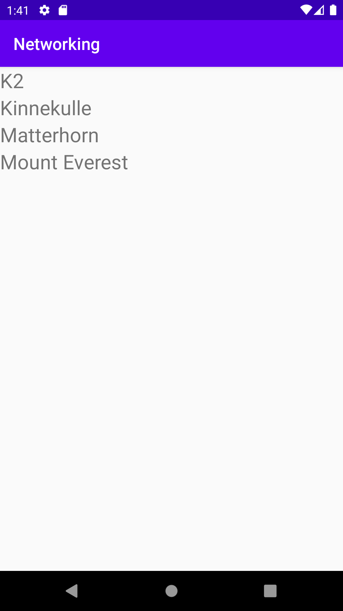

# Report

Firstly, the default textView in activity_main was replaced with a recyclerview and in main activity an arraylist of mountain-objects was created. The class mountain
was also created. After this the adapter for the recyclerView was created. It was made with the needed standardized functions including inflating an item, to 
allow for this a layout called list_item was created. In that same file the viewholder was created. After this the url to the json was given, the permission
for internet access was given and a toString function for mountain was defined.

The Json data was then parsed into an arraylist of strings with the names using Gson according to lectures and the infromation was parsed into the recyclerView
once when the app is started and then when json is loaded. 

```
public void onPostExecute(String json) {
        Gson gson = new Gson();

        Type type = new TypeToken<List<Mountain>>() {}.getType();
        mountainList = gson.fromJson(json, type);

        mountainNameList = new ArrayList<String>();

        for (int i = 0; i < mountainList.size(); i++){
            mountainNameList.add(mountainList.get(i).toString());
        }

        mountainAdapter.setMountains(mountainNameList);
        mountainAdapter.notifyDataSetChanged();
    }
```


